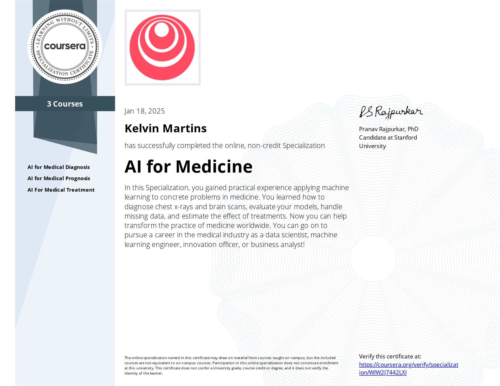

# About this repository

Solved programming assignments from [Coursera AI for Medicine specialization](https://www.coursera.org/specializations/ai-for-medicine) offered by [deeplearning.ai](https://www.deeplearning.ai/).

# List of courses

1. [AI for Medical Diagonis](./course-01-ai-for-medical-diagnosis/)

2. [AI for Medical Prognosis](./course-01-ai-for-medical-prognosis/)

2. [AI for Medical Treatment](./course-01-ai-for-medical-treatment/)
---

